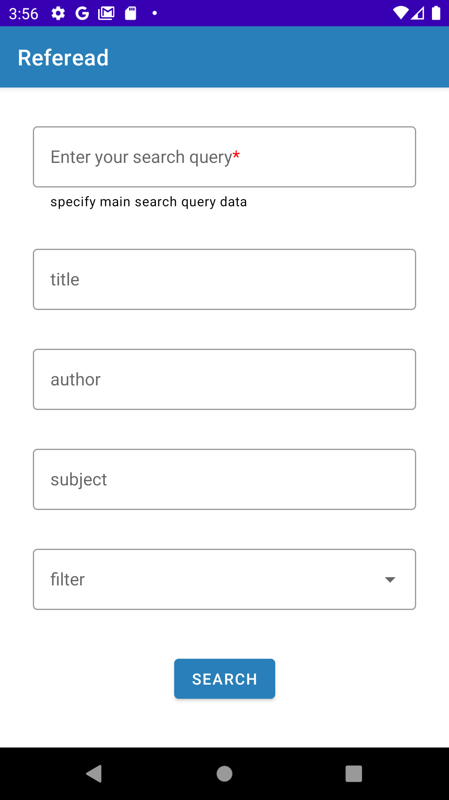
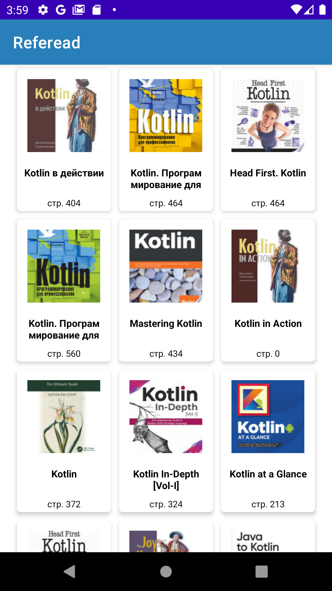
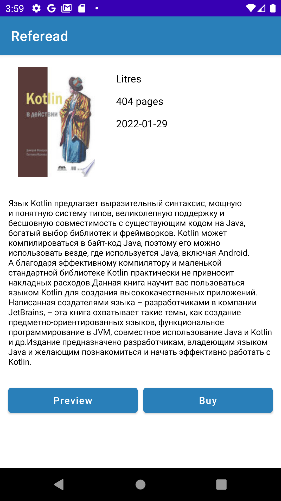

# Referead

## Описание

В качестве итогового выпускного проекта сделано небольшое приложение для поиска книг на языке Kotlin.

Ключевые моменты:
- Приложение выполнено с соблюдением принципа Single Activity. Для навигации между фрагментами используется Navigation Component.
- При разработке испрользовался подход MVVM.
- Для сетевого взаимодействия использована библиотека Retrofit и стандартный механизм сериализации Kotlin Parcelize.
- Для реализации Dependency Injection использованы библиотеки Hilt и Dagger.
- Реализован механизм пагинации для динамической подгрузки списка книг.
- Получение данных происходит через [Google Books Api](https://developers.google.com/books/docs/v1/using?hl=ru).

### Демонстрация

Приложение состоит из трёх экранов.

1. Экран ввода поисковых параметров

На данном экране пользователь задаёт необходимые поисковые параметры.
- Search query - обязательное поле, которое является основой поискового запроса. При поиске томов прежде всего проверяется наличие данной строки.
- title - опциональное поле, позволяющее уточнить текст, который должен присутствовать в заголовке.
- author - опциональное поле, позволяющее уточнить текст, который должен присутствовать в имени автора.
- subject - опциональное поле, позволяющее уточнить текст, который должен быть указан в списке категорий тома.
- filter - опциональное поле в виде выпадающего меню, позволяющее фильтровать результаты поиска:
    - Full - возвращает только те результаты, в которых виден весь текст.
    - partial — возвращает результаты, в которых хотя бы часть текста доступна для предварительного просмотра.
    - free-ebooks — возвращает только бесплатные электронные книги Google.
    - paid-ebooks — возвращаются только результаты, которые являются электронными книгами Google с указанием цены.
    - ebooks — возвращаются только результаты, которые являются электронными книгами Google, платными или бесплатными
    
После указания необходимых поисковых данных и нажатия на кнопку Search происходит переход на экран списка книг.

2. Экран вывода результатов поиска

На данном экране представлен список найденных томов по заданным критериям поиска.
На каждом элементе списка выводится превью изображения, название тома и количество страниц в нём.
При нажатии на конкретный том происходит переход на экран детальной информации о томе.

3. Экран деталей о томе

На данном экране представлена детальная информация о выбранном томе. Справа от изображения расположены: наименование издателя, количество страниц и дата публикации.
Ниже расположено описание, которое можно прокручивать, в случае, если оно не помещается на экране. Под ним расположены две кнопки Preview и Buy. 
- По нажатию на кнопку **Preview** открывается страница в браузере для предварительного просмотра этого тома на сайте Google Книг.
- По нажатию на кнопку **Buy** происходит переход в Google Play для покупки данного тома, если он платный. Для бесплатных томов на данный момент реализовано лишь отображение Toast сообщения об отсутствии страницы покупки для данного тома.

## Возможные улучшения
- Реализовать возможность добавления томов в список избранного.
- Реализовать возможность изменения параметров поиска находясь при этом на странице со списком результатов. Например, изменение параметров фильтрации.
- Добавить возможность скачивания бесплатных томов.
